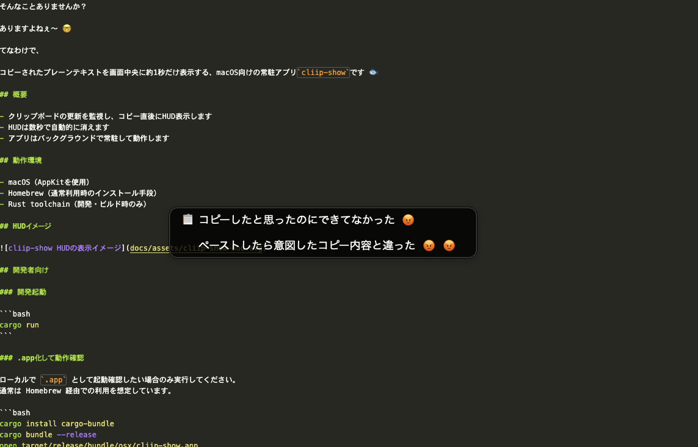

# homebrew-tools

`cliip-show` などを Homebrew で配布するための Tap リポジトリです。

## 機能1: cliip-show

- source repository: <https://github.com/somei-san/cliip-show>
- formula: `Formula/cliip-show.rb`

### cliip-show とは

`cliip-show` は macOS 向けの常駐アプリです。  
クリップボードにコピーされたプレーンテキストを検知し、画面中央に短時間（約1秒）HUD 表示します。



### インストール（初回導入）

```bash
brew tap somei-san/tools
brew install somei-san/tools/cliip-show
brew services start cliip-show
```

各コマンドの意味:

1. `brew tap somei-san/tools`: `somei-san/tools` Tap を Homebrew に登録します。
2. `brew install cliip-show`: Tap に含まれる `cliip-show` Formula から本体をインストールします。
3. `brew services start cliip-show`: `cliip-show` を常駐起動し、ログイン時の自動起動も有効にします（初期導入時は必須）。

1 行で実行する場合:

```bash
brew tap somei-san/tools && brew install somei-san/tools/cliip-show && brew services start cliip-show
```

### 起動・停止（ログイン時自動起動）

`cliip-show` は Homebrew Service として動作します。

```bash
brew services start cliip-show
```

停止:

```bash
brew services stop cliip-show
```

状態確認:

```bash
brew services list
```

### 動作確認

```bash
cliip-show --version
cliip-show --help
```

### ログ

Homebrew のログ出力先:

```bash
$(brew --prefix)/var/log/cliip-show.log
```

### アンインストール

```bash
brew services stop cliip-show
brew uninstall cliip-show
```

Tap 自体も外す場合:

```bash
brew untap somei-san/tools
```

### メンテナー向け

詳細手順:

<https://github.com/somei-san/cliip-show/blob/main/docs/Homebrewで公開する手順.md>
